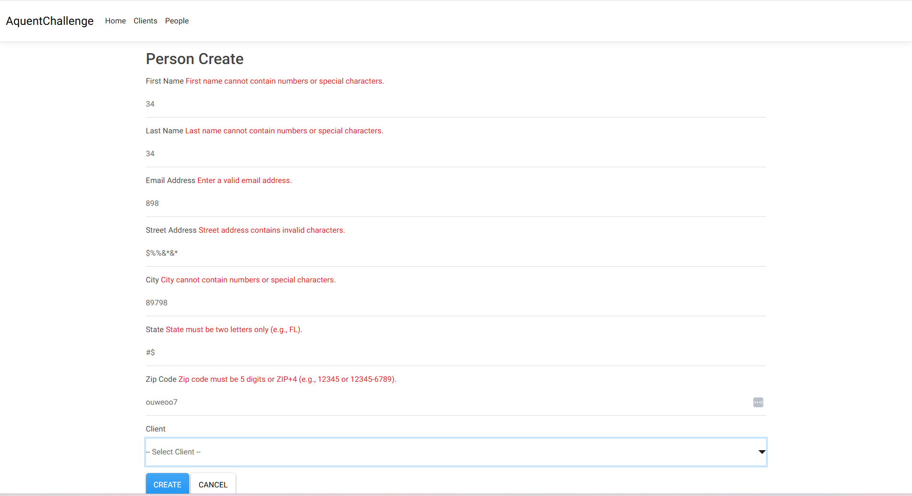

# Aquent Challenge – Enterprise-Grade ASP.NET MVC CRUD Application
## Table of Contents
1. [Overview](#overview)
2. [Tech Stack](#tech-stack)
   - [.NET Ecosystem](#net-ecosystem)
   - [Java / JSP / J2EE Ecosystem Comparison](#java--jsp--j2ee-ecosystem-comparison)
3. [Setup Instructions](#setup-instructions)
4. [Acceptance Criteria](#acceptance-criteria)
   - [Story #1 – Manage Clients and Relationships](#story-1--manage-clients-and-relationships)
   - [Story #2 – Client-Side Styling and Validation](#story-2--client-side-styling-and-validation)
   - [Technical Enhancements](#technical-enhancements)
5. [Project Structure and Features](#4-project-structure-and-features)
   - [Data Model (Entities and ViewModels)](#data-model-entities--viewmodels)
   - [Core Features](#core-features)
   - [Validation](#validation)
   - [Logging and Error Handling](#logging--error-handling)
   - [Entity Framework Core](#entity-framework-core)
   - [UI Enhancements](#ui-enhancements)
       - [Vue.js Toast Notifications](#vuejs-toast-notifications)
       - [Delete Confirmation Modal](#delete-confirmation-modal)
       - [Bootswatch Materia Theme](#bootswatch-materia-theme)
   - [Security](#security)
   - [Architecture and Key Decisions](#architecture--key-decisions)
6. [Functionality Screenshots](#functionality-screenshots)
7. [Known Limitations and Future Improvements](#known-limitations-and-future-improvements)


## Overview
The **Aquent Challenge** project represents a **self-contained enterprise feature slice**, designed to mimic how production-ready systems are built.  
While the task is a simple CRUD application, its structure, error handling, validation, and logging follow enterprise development standards.  

The project demonstrates:
- Full MVC architecture with ViewModels, DI, and EF Core ORM  
- Secure, validated form submissions (anti-forgery, XSS-safe Razor views)  
- Reactive user feedback (Vue.js toasts)  
- Modern UI/UX using Bootstrap 5 + Bootswatch Materia  
- Centralized logging and error handling, mirroring real-world operations  

This project could be production-ready with minimal additional testing or user authentication.


[Back to Table of Contents](#table-of-contents)
---

## Tech Stack

### .NET Ecosystem
| Layer | Technology | Description |
|-------|-------------|-------------|
| Language | **C# / ASP.NET Core 8 (MVC)** | Web framework using controllers, Razor views, and middleware |
| ORM / Data Access | **Entity Framework Core** | ORM handling schema migrations, LINQ queries, and tracking |
| Database | **SQLite (Local Dev)** | Lightweight relational database for persistence |
| Frontend | **Razor Views**, **Bootstrap 5**, **Bootswatch Materia** | Modern, responsive design and theming |
| Reactive Enhancement | **Vue.js 3** | Global reactive toast notifications |
| Validation | **DataAnnotations + jQuery Unobtrusive Validation** | Server and client validation parity |
| Logging | **ILogger (structured)** | Context-aware logging for controller activity |
| Error Handling | **Middleware-based global exception handling** + **custom error pages** | Enterprise-ready error resiliency |
| Security | **Anti-forgery tokens**, **automatic Razor HTML encoding**, **validated inputs** | Prevents XSRF and XSS attacks |

---

### Java / JSP / J2EE Ecosystem Comparison
| .NET Feature | Java/JEE Equivalent | Description / Comparison |
|---------------|--------------------|---------------------------|
| ASP.NET Core MVC | Spring MVC / Jakarta EE MVC | Controller-view pattern for routing and DI |
| Razor View Engine | JSP / Thymeleaf | Razor integrates C# expressions directly, auto-encodes output |
| EF Core | JPA / Hibernate | ORM with LINQ-based queries (type-safe alternative to JPQL) |
| LINQ Queries | JPQL / Criteria API | Strongly-typed, fluent querying syntax versus string-based JPQL |
| Middleware Pipeline | Servlet Filters / Interceptors | Request/response interception and processing pipeline |
| Program.cs Configuration | `@SpringBootApplication` | Centralized startup and DI configuration |
| TempData / ViewData | FlashScope / RequestScope | Mechanism for short-lived state between actions |
| ILogger / Serilog | SLF4J / Logback | Structured, contextual logging |
| appsettings.json | application.properties / YAML | Environment-based configuration system |
| Built-in DI | Spring IoC / CDI | Scoped service lifetimes natively supported |
| Razor HTML Encoding | JSTL `<c:out>` | Razor encodes all dynamic output by default (prevents XSS) |
| [ValidateAntiForgeryToken] | Spring Security CSRF Token | Cross-Site Request Forgery protection |
| SQLite + EF Migrations | H2 + Liquibase/Flyway | Embedded DB with schema migrations |
| NuGet | Maven | Dependency management and build system |


[Back to Table of Contents](#table-of-contents)
---

##  Setup Instructions

(Windows, sorry Mac users)

These instructions were written for and tested on a non-technical person with a laptop with 14 broken keyboard keys running Windows 10.

1. Install [.NET 8 SDK](https://dotnet.microsoft.com/download) using the install wizard
2. Open a terminal and run this command to verify installation:
   ```
   dotnet --version
   ```
4. Download this [fork](https://github.com/Ab0213ab/andrew-schaefer-dotnet-crud-app) as a zip file onto your machine.
5. Navigate to File Explorer > Downloads and right-click the zip file.
6. Click 'Extract Files' and choose a memorable storage location on your machine
7. Navigate to AquentChallenge/AquentChallenge in the project. Find where the AquentChallenge.csproj file is located.
8. In the same folder as the AquentChallenge.csproj file, click the File Explorer search bar and type 'cmd' + ENTER.
9. After the terminal window opens, type the following commands one at a time:
   ```
   dotnet restore
   dotnet build
   dotnet run
   ```
10. Open an internet browser and in the URL bar, type ``http://localhost:5094``. Note: the port number may differ for your setup.
11. Happy CRUDing!

[Back to Table of Contents](#table-of-contents)
---

## Acceptance Criteria

Each story and its requirements were fully implemented.

### Story #1 – Manage Clients and Relationships
| Requirement | Implementation | File/Path |
|--------------|----------------|-----------|
| CRUD operations for Clients | Full MVC CRUD with soft delete | `/Controllers/ClientsController.cs`, `/Views/Clients/` |
| Client fields (name, website, phone, address) | Validated with DataAnnotations | `/Models/ViewModels/ClientFormViewModel.cs` |
| Clients have zero or many contacts | FK: `Person.ClientId` | `/Models/Person.cs`, `/Data/AppDbContext.cs` |
| Editing a Person lets user choose Client | Dropdown list bound to `Clients` | `/Views/Shared/_PersonForm.cshtml` |
| Viewing a Person shows associated Client | Joined data query | `/Controllers/PeopleController.cs` |
| Viewing a Client shows associated People | LINQ join with client filter | `/Controllers/ClientsController.cs` |
| Editing a Client allows adding/removing People | Checkbox list for associated contacts | `/Views/Shared/_ClientForm.cshtml` |

### Story #2 – Client-Side Styling and Validation
| Requirement | Implementation | File/Path |
|--------------|----------------|-----------|
| Client-side validation | jQuery Validation + DataAnnotations | `/Views/Shared/_ValidationScriptsPartial.cshtml` |
| Styling | Bootstrap 5 + Bootswatch Materia | `_Layout.cshtml`, `/wwwroot/css/site.css` |
| Equivalent validation rules | DataAnnotations mirrored in JS | `/Models/ViewModels` |
| Visual feedback on CRUD actions | Vue.js global toast system | `_Layout.cshtml`, `/wwwroot/js/toastApp.js` |

### Technical Enhancements
| Feature | Description |
|----------|--------------|
| Global error handling middleware | Centralized exception pipeline in `Program.cs` |
| Explicit try/catch blocks | Showcase of enterprise logging and resilience |
| AJAX deletion with modal confirmation | Dynamic UI updates without reload |
| Custom error pages | Graceful handling of unexpected errors |
| Anti-forgery token validation | Razor + `[ValidateAntiForgeryToken]` attribute |
| HTML encoding for XSS prevention | Razor auto-encodes dynamic content |
| Structured logging | Contextual and event-based controller logging |


[Back to Table of Contents](#table-of-contents)
---

## Project Structure and Features

### Data Model (Entities and ViewModels)
- **Entities:** Define core schema and relationships (Clients–People).  
  Relationships modeled with explicit foreign keys only, improving clarity and preventing unwanted EF cascades.  
- **ViewModels:** Contain validation logic and UI-bound fields, separating persistence from presentation.

---

### Core Features
#### Clients
- Full CRUD (create/edit/delete/view).  
- Associates People through a one-to-many FK (`ClientId`).  
- Soft deletes via `IsDeleted` flag for auditability.

#### People
- CRUD operations with linked Client selection.  
- Client name displayed across list and detail views.

---

### Validation
- Server-side: enforced through C# DataAnnotations.  
- Client-side: powered by jQuery Unobtrusive Validation for UX parity.  
- Prevents invalid submissions before and after form submission.

---

### Logging and Error Handling
- **Middleware-based global exception handler** for unexpected runtime errors.  
- **Explicit try/catch blocks** in CRUD controllers showcase enterprise defensive programming.  
- **Custom Error Pages** (`/Views/Shared/Error.cshtml`) provide user-friendly messages.

---

### Entity Framework Core
EF Core manages data persistence using LINQ-based queries and migrations.  
It provides schema versioning, relationship mapping, and entity tracking.  

**Java Analogy:**  
EF Core ≈ Hibernate/JPA, LINQ ≈ JPQL, Migrations ≈ Liquibase/Flyway.  

---

### UI Enhancements
#### Vue.js Toast Notifications
A lightweight Vue instance provides reusable, reactive toasts across all controllers (Create/Edit/Delete).  
Triggers:
- Via `TempData` after redirects  
- Via AJAX on delete success  
Allows consistent UI feedback with zero duplication.

#### Delete Confirmation Modal
Bootstrap modal wired via jQuery for confirmation before deletion.  
Uses AJAX to remove entries dynamically.

#### Bootswatch Materia Theme
Aesthetic enhancement using Bootswatch’s **Materia** theme for polished, consistent visuals.

---

### Security
This project employs multiple layers of built-in security:

| Mechanism | Purpose | Implementation |
|------------|----------|----------------|
| **Anti-forgery tokens** | Prevent Cross-Site Request Forgery (XSRF) | `@Html.AntiForgeryToken()` in Razor forms + `[ValidateAntiForgeryToken]` in controllers |
| **Razor HTML encoding** | Prevent Cross-Site Scripting (XSS) | Razor automatically encodes dynamic content |
| **Model validation** | Prevent malicious inputs | Strongly-typed ViewModels with validation attributes |
| **AJAX token inclusion** | Maintain form authenticity on async calls | Token passed via POST data during AJAX deletion |

All forms are protected automatically; validation occurs before controller logic executes.

---

### Architecture and Key Decisions
- **Pattern:** MVC using strongly-typed ViewModels.  
- **No navigation properties:** foreign-key-only relationships for clarity.  
- **Soft delete pattern:** `IsDeleted` flag maintains data history.  
- **Global error pipeline:** centralized handling and structured logging.  
- **Vue.js for reusability:** consistent notifications across all feature actions.  

---

## Functionality Screenshots

 

Paired Client and Server Side Validation via jQuery + .NET Data Annotations          
 

Modern UI Enhancements using Vue.js, Bootstrap5, and jQuery
 


Custom Error Pages Rendered through Global and In-Line Error Handling


Robust, Production-Ready Logging with Serilog


[Back to Table of Contents](#table-of-contents)
---

## Known Limitations and Future Improvements
- Automated tests (unit/integration) not yet implemented.  
- Accessibility (WCAG/ARIA) to be expanded.  
- Repository/service abstraction could further decouple EF Core logic.  
- Future additions: authentication, authorization, and deployment automation.


[Back to Table of Contents](#table-of-contents)
---
